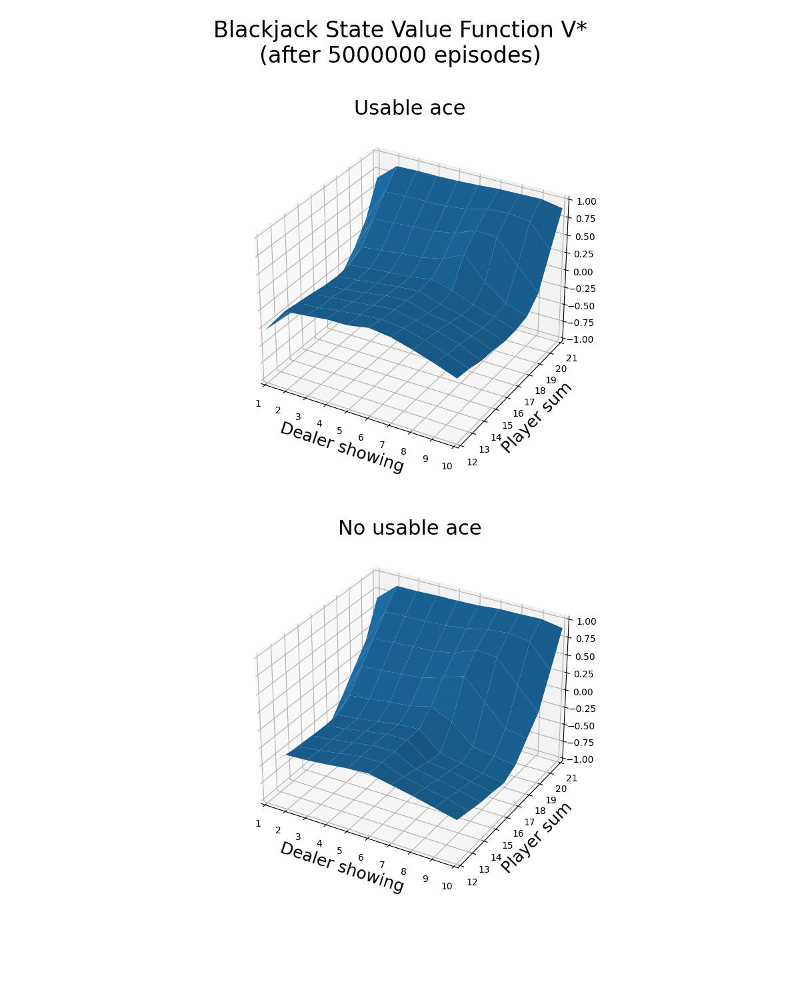

<h1>Monte Carlo Control with Exploring Starts</h1>

Monte Carlo is a model-free algorithm, which does not assume any knowledge of MDP transitions or rewards. Instead, the 
dynamics of the environment are learnt from episodes of experience.

 episodes are sampled in the following way:

- the 1st state  and action 
are sampled uniformly at random.
- the following actions 
are selected based on a greedy policy , such that: 

<!---
\pi(s) = \underset{a}{argmax} \ Q(s,a)
--->

<p align="center">

</p>

For a state-action pair  of the episode, we calculate 
the discounted return :

<!---
G_t = R_{t+1} + \gamma R_{t+2} + \dots + \gamma^{T-t-1} R_{T}
--->

<p align="center">

</p>

This is an implementation of the first-visit Monte Carlo Control algorithm; if a state-action pair 
is visited more than once, 
with , the discounted return is calculated
only the first time , during which the state-action pair 
 was visited. 

At the end of each episode, the state-action value function 
(and therefore the policy ) is updated for each of the
state-action pairs  
that were visited, such that:

<!---
\begin{align*}
& N(S_t, A_t) \leftarrow N(S_t, A_t) + 1\\
& Q(S_t, A_t) \leftarrow Q(S_t, A_t) + \frac{1}{N(S_t, A_t)} [G_t - Q(S_t, A_t)]
\end{align}
--->

<p align="center">

</p>

Given that  is sampled at random, 
when the number of episodes ,
all the action-state pairs  are sufficiently explored.

The algorithm converges to the optimal state-action value function 
and, therefore, to the optimal strategy .

This is exercise is based on:
- Example 5.3 of Sutton's book "Reinforcement Learning: An Introduction (2nd Edition)"
 

The object of the popular casino card game of blackjack is to obtain cards the sum of whose numerical values is as great
as possible without exceeding 21. All face cards count as 10, and an ace can count either as 1 or as 11. We consider the
version in which each player competes independently against the dealer. The game begins with two cards dealt to both
dealer and player. One of the dealer’s cards is face up and the other is face down. If the player has 21 immediately 
(an ace and a 10-card), it is called a natural. He then wins unless the dealer also has a natural, in which case the
game is a draw. If the player does not have a natural, then he can request additional cards, one by one (hits), until he
either stops (sticks) or exceeds 21 (goes bust). If he goes bust, he loses; if he sticks, then it becomes the dealer’s
turn. The dealer hits or sticks according to a fixed strategy without choice: he sticks on any sum of 17 or greater, and
hits otherwise. If the dealer goes bust, then the player wins; otherwise, the outcome—win, lose, or draw—is determined 
by whose final sum is closer to 21.

Playing blackjack is naturally formulated as an episodic finite MDP. Each game of blackjack is an episode. Rewards of
+1, 1, and 0 are given for winning, losing, and drawing, respectively. All rewards within a game are zero, and we do not
discount ; therefore 
these terminal rewards are also the returns. The player’s actions are to hit or to stick. The states depend on the
player’s cards and the dealer’s showing card. We assume that cards are dealt from an infinite deck (i.e., with 
replacement) so that there is no advantage to keeping track of the cards already dealt. If the player holds an ace that
he could count as 11 without going bust, then the ace is said to be usable. In this case it is always counted as 11 
because counting it as 1 would make the sum 11 or less, in which case there is no decision to be made because, 
obviously, the player should always hit. Thus, the player makes decisions on the basis of three variables: his current
sum (12–21), the dealer’s one showing card (ace–10), and whether or not he holds a usable ace. This makes for a total of 
200 states.

```commandline
usage: blackjack_mcces.py [--n_episodes N_EPISODES] [--gamma GAMMA] [--plot] [-h]

optional arguments:
  --n_episodes N_EPISODES
                        The number of episodes to sample (DEFAULT=5000000)
  --gamma GAMMA         The discount factor of the Monte Carlo Control with Exploring Starts algorithm. (DEFAULT=1.0)
  --plot                Plot and save as blackjack_mcces_v.jpg the state value function of the optimal policy and as blackjack_mcces_policy.jpg the optimal policy. (DEFAULT=False)
  -h, --help            Show this help message and exit.
```

```commandline
python3 blackjack_mcces.py --plot
```

<p align="center">


</p>
