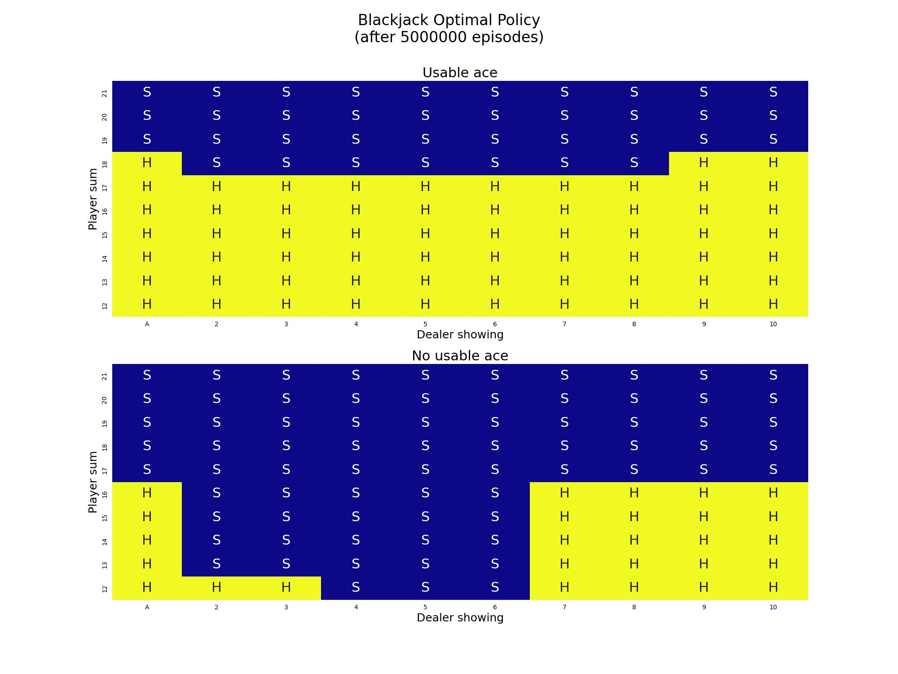
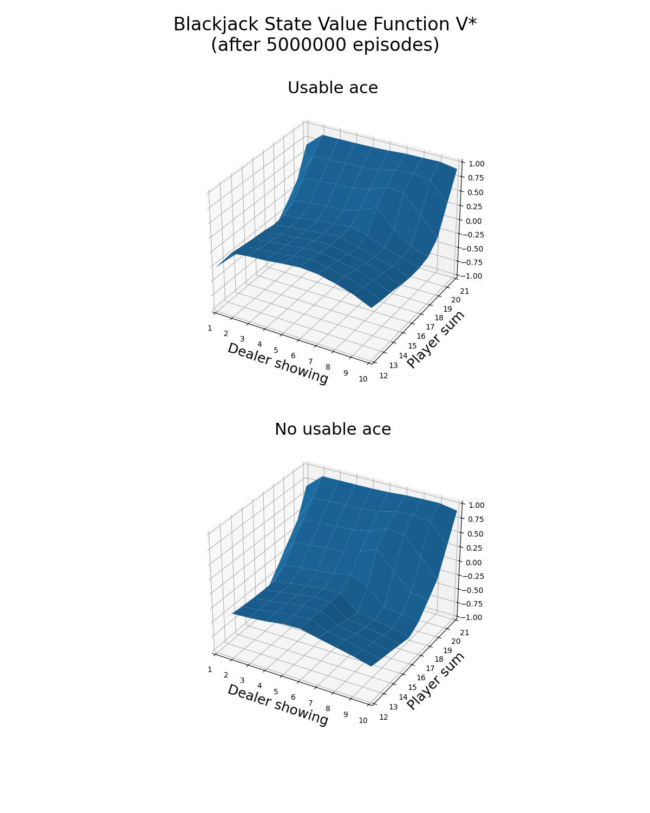

<h1>Off-Policy Monte Carlo Control with Weighted Importance Sampling</h1>

Monte Carlo is a model-free algorithm, which does not assume any knowledge of MDP transitions or rewards. Given that
this is an off-policy algorithm, the actions  
are sampled from the behavior policy  for each of the 
 episodes of Monte Carlo:

<!---
A_1, A_2, \dots, A_{T-1} \sim b
--->

<p align="center">

</p>

The behavior policy  is an
-greedy policy, where:

<!---
b(a|s) = \left \{\begin{array}{ll}
     1 - \epsilon + \frac{\epsilon}{|A|}, & a = \underset{a'}{argmax} \ Q(s,a')\\
     \frac{\epsilon}{|A|}, & otherwise\\
\end{array}
\right.
--->

<p align="center">

</p>

with:

<!---
\epsilon = \sqrt{{\frac{N_0}{N_0 + N}}
--->

<p align="center">

</p>

where 
is the current episode and  is a constant.

The goal of the algorithm is to learn an optimal target strategy .
The strategy  is selected to be greedy with respect to
the state-action value function :
<!---
\pi(a|s) = \left \{\begin{array}{ll}
     1 , & a = \underset{a'}{argmax} \ Q(s,a')\\
     0, & otherwise\\
\end{array}\right.
--->

<p align="center">

</p>

This is an implementation of the Every-Visit Monte Carlo algorithm; all the state-action pairs 
are taken into account, even if there are duplicates, i.e.  
with . For each state-action pair,
the discounted reward  is calculated:

<!---
G_t = R_{t+1} + \gamma R_{t+2} + \dots + \gamma^{T-t-1} R_{T}
--->

<p align="center">

</p>

Nevertheless, in order to estimate the state-action value function of target policy ,
while following a different behavior policy , importance 
sampling is needed:
<!---
\begin{align*}
Q_{\pi}(s, a) &= \mathop{\mathbb{E}}[G_t | (S_t, A_t)=(s,a), A_{t+1}, A_{t+2},\dots, A_{T-1} \sim \pi]\\
&= \frac{\pi(A_{t+1}|S_{t+1})}{b(A_{t+1}|S_{t+1})} \dots \frac{\pi(A_{T-1} | S_{T-1})}{b(A_{T-1} | S_{T-1})} \mathop{\mathbb{E}}[G_t | (S_t, A_t)=(s,a), A_{t+1}, A_{t+2},\dots, A_{T-1} \sim b]\\
&= \prod_{k=t+1}^{T-1} \frac{\pi(A_k|S_k)}{b(A_k|S_k)} \ \mathop{\mathbb{E}}[G_t | (S_t, A_t)=(s,a), A_{t+1}, A_{t+2},\dots, A_{T-1} \sim b]
\end{align}  
--->

<p align="center">

</p>

The importance sampling ratio  is calculated for
each state-action pair 
and is equal to:


<!---
\rho_t = \prod_{k=t+1}^{T-1} \frac{\pi(A_k|S_k)}{b(A_k|S_k)}
--->

<p align="center">

</p>

The idea of Weighted Importance Sampling is to compute the state-action value function 
of the target policy  as:

<!---
Q(s,a) = \frac{\underset{k}{\sum} \rho_k(s,a) \ G_k(s,a)}{\underset{k}{\sum} \rho_k(s,a)}
--->

<p align="center">

</p>

In this implementation, the updates of the Q values are performed incrementally for each state-action value of an episode:
<!---
\begin{align*}
& c \leftarrow c + \rho \\
& Q(S_t,A_t) \leftarrow Q(S_t, A_t) + \frac{\rho}{c} (G_t - Q(S_t, A_t))\\
& \rho \leftarrow \rho \ \frac{\pi(A_t|S_t)}{b(A_t|S_t)}\\
\end{align} 
--->

<p align="center">

</p>

with the values initialized at the start of each episode as 
and . Whenever the values 
values are updated, both the behavior policy  and the
target policy  are also implicitly updated.

Given that target strategy  is deterministic, we have
2 cases:

- 

In this case,   and,
as a result, the importance sampling ratio update rule can be rewritten as:

<p align="center">

</p>

- 

This means that  and
 for the remainder of the episode and, as a result,
the state-action value function will no longer be updated. Therefore, it is ok to break the loop and proceed to the next
episode.

This is exercise is based on:
- Example 5.3 of Sutton's book "Reinforcement Learning: An Introduction (2nd Edition)"
- Exercise 5.11 of Sutton's book "Reinforcement Learning: An Introduction (2nd Edition)"

The object of the popular casino card game of blackjack is to obtain cards the sum of whose numerical values is as great
as possible without exceeding 21. All face cards count as 10, and an ace can count either as 1 or as 11. We consider the
version in which each player competes independently against the dealer. The game begins with two cards dealt to both
dealer and player. One of the dealer’s cards is face up and the other is face down. If the player has 21 immediately 
(an ace and a 10-card), it is called a natural. He then wins unless the dealer also has a natural, in which case the
game is a draw. If the player does not have a natural, then he can request additional cards, one by one (hits), until he
either stops (sticks) or exceeds 21 (goes bust). If he goes bust, he loses; if he sticks, then it becomes the dealer’s
turn. The dealer hits or sticks according to a fixed strategy without choice: he sticks on any sum of 17 or greater, and
hits otherwise. If the dealer goes bust, then the player wins; otherwise, the outcome—win, lose, or draw—is determined 
by whose final sum is closer to 21.

Playing blackjack is naturally formulated as an episodic finite MDP. Each game of blackjack is an episode. Rewards of
+1, 1, and 0 are given for winning, losing, and drawing, respectively. All rewards within a game are zero, and we do not
discount ; therefore 
these terminal rewards are also the returns. The player’s actions are to hit or to stick. The states depend on the
player’s cards and the dealer’s showing card. We assume that cards are dealt from an infinite deck (i.e., with 
replacement) so that there is no advantage to keeping track of the cards already dealt. If the player holds an ace that
he could count as 11 without going bust, then the ace is said to be usable. In this case it is always counted as 11 
because counting it as 1 would make the sum 11 or less, in which case there is no decision to be made because, 
obviously, the player should always hit. Thus, the player makes decisions on the basis of three variables: his current
sum (12–21), the dealer’s one showing card (ace–10), and whether or not he holds a usable ace. This makes for a total of 
200 states.

```commandline
usage: blackjack_off_policy_mcc.py [--n_episodes N_EPISODES] [--gamma GAMMA] [--plot] [-h]

optional arguments:
  --n_episodes N_EPISODES
                        The number of episodes to sample using the behavior policy (DEFAULT=5000000)
  --gamma GAMMA         The discount factor of the Monte Carlo Prediction algorithm. (DEFAULT=1.0)
  --plot                Plot and save as blackjack_offpolicy_mcc_wis_v.jpg the state value function of the final target (optimal) policy and as blackjack_offpolicy_mcc_wis_policy.jpg the target policy. (DEFAULT=False)
  -h, --help            Show this help message and exit.
```


```commandline
python3 blackjack_off_policy_mcc.py --plot
```

<p align="center">


</p>