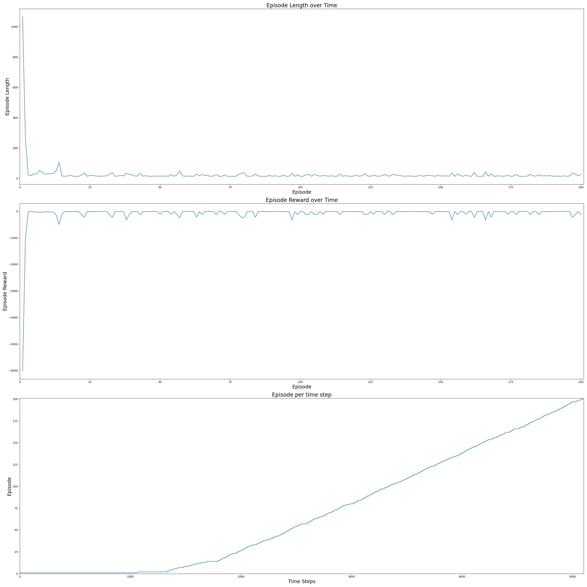
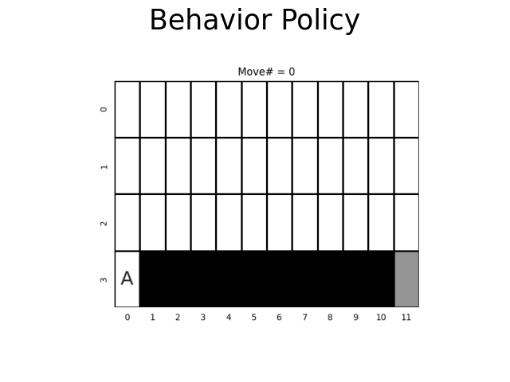
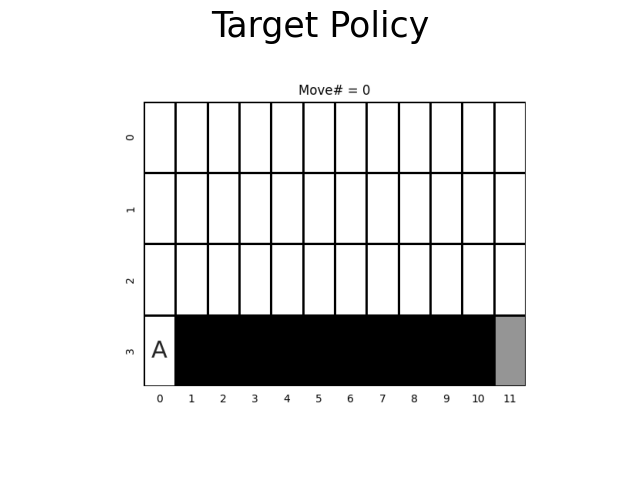

<h1>Q-Learning (Off-Policy TD Learning)</h1>

Q-Learning is a model-free algorithm, which does not assume any knowledge of MDP transitions or rewards. Given that
this is an off-policy algorithm, the actions  
are sampled from the behavior policy  for each of the 
 episodes of the algorithm:

<!---
A_1, A_2, \dots, A_{T-1} \sim b
--->
<p align="center">

</p>

The behavior policy  is an
-greedy policy, where:

<!---
b(a|s) = \left \{\begin{array}{ll}
     1 - \epsilon + \frac{\epsilon}{|A|}, & a = \underset{a'}{argmax} \ Q(s,a')\\
     \frac{\epsilon}{|A|}, & otherwise\\
\end{array}
\right.
--->
<p align="center">

</p>

with .

The goal of the algorithm is to learn an optimal target strategy .
The strategy  is selected to be greedy with respect to
the state-action value function :

<!---
\pi(a|s) = \left \{\begin{array}{ll}
     1 , & a = \underset{a'}{argmax} \ Q(s,a')\\
     0, & otherwise\\
\end{array}\right.
--->
<p align="center">

</p>

Given a state , the action 
is sampled based on the behavior policy  in order to update
the state-action value function .
Following that, we observe the reward  and
the next state  and select the next action
 based on the target policy 
(greedily). The state-action function 
is updated using bootstrapping:

<!---
Q(S_t, A_t) \leftarrow Q(S_t, A_t) + \alpha (Q(S_{t+1}, A') - Q(S_t, A_t))
--->
<p align="center">

</p>

Afterwards, the same process is repeated for the state ,
unless it is a terminal state.

The TD learning rate , satisfies the Robbins-Monro
criteria:

<!---
\begin{align*}
& \sum_{n=1}^{\infty} \alpha_n = \infty \\
& \sum_{n=1}^{\infty} \alpha_n^2 < \infty \\\
end{align} 
--->
<p align="center">

</p>

since:

<!---
\alpha(s,a) = \sqrt[3]{\frac{10}{10 + N(s,a)}}^2
--->
<p align="center">

</p>

As a result, the target policy of the Q-Learning algorithm converges to the optimal policy.

This exercise is based on:
- Example 6.6 of Sutton's book "Reinforcement Learning: An Introduction (2nd Edition)"

Cliff Gridworld is a 4x12 gridworld with:
- start state: (3, 0)
- goal state: (3, 11)
- the usual actions causing movement up, down, right, and left, which incur a reward of -1

Compared to a standard gridworld, in this environment, there is a cliff region. When the agent steps into a cell of this
region, he receives a reward of -100 and goes back to the start state instantly. The cells of the cliff region are:
(3, 1), (3, 2), (3, 3), (3, 4), (3, 5), (3, 6), (3, 7), (3, 8), (3, 9) and (3, 10).

```commandline
usage: cliff_gridworld_qlearning.py [--n_episodes N_EPISODES] [--gamma GAMMA] [--epsilon EPSILON] [--plot] [-h]

optional arguments:
  --n_episodes N_EPISODES
                        The number of episodes to sample (DEFAULT=200)
  --gamma GAMMA         The discount factor of the Q-Learning (Off-Policy TD learning) algorithm. (DEFAULT=1.0)
  --epsilon EPSILON     The epsilon of the epsilon-greedy behaviour strategy b of the Q-Learning (Off-Policy TD learning) algorithm. (DEFAULT=0.1)
  --plot                Plot and save (as cliff_gridworld_qlearning_stats.jpg) the statistics of the Q-learning algorithm in the Cliff GridWorld over time, the optimal trajectory (as cliff_gridworld_qlearning_animation.gif) of the
                        agent following the final (deterministic) target policy and the trajectory (as cliff_gridworld_epsilon_greedy_animation.gif) of the agent following the final (stochastic) behavior strategy. (DEFAULT=False)
  -h, --help            Show this help message and exit.
```

```commandline
python3 cliff_gridworld_qlearning.py
```

<p align="center">



</p>