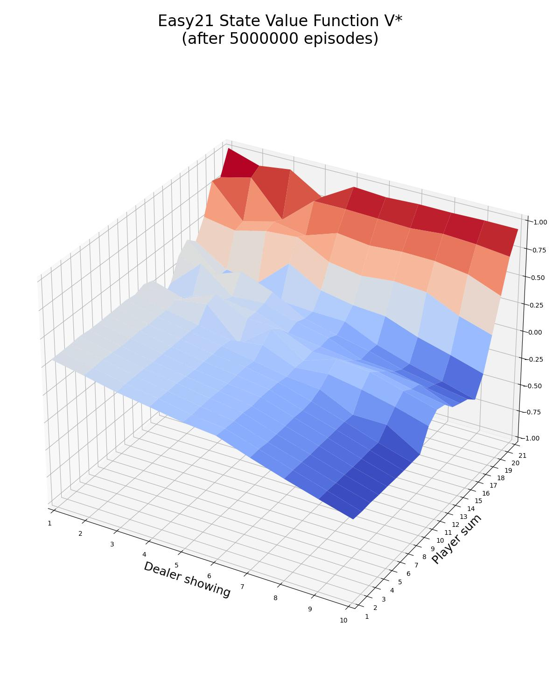

<h1>On-Policy Monte Carlo Control</h1>

Monte Carlo is a model-free algorithm, which does not assume any knowledge of MDP transitions or rewards. Instead, the 
dynamics of the environment are learnt from episodes of experience.

We generate  episodes and, in each of them,  the actions
 are sampled following an 
-greedy policy :

<!---
A_1, A_2, \dots, A_{T-1} \sim \pi
--->
<p align="center">

</p>

The -greedy policy 
is defined in the following way:

<!---
\pi(a|s) = \left \{\begin{array}{ll}
     1 - \epsilon + \frac{\epsilon}{|A|}, & a = \underset{a'}{argmax} \ Q(s,a')\\
     \frac{\epsilon}{|A|}, & otherwise\\
\end{array}\right.
--->
<p align="center">

</p>

with:

<!---
\epsilon(s) = \frac{N_0}{N_0+N(s)}
--->
<p align="center">

</p>

where  is a constant (with 100 as its default value)
and  is the total number of updates of the 
state-action value function .
The epsilon-greedy policy  satisfies the GLIE (Greedy 
in the Limit with Infinite Exploration) criteria:

<!---
\begin{align*}
& \underset{k \to \infty}{lim} \ N_k(s,a) \to \infty \\
& \underset{k \to \infty}{lim} \ \pi_k(a|s) = \textbf{1}(a = \underset{a' \in A}{argmax} \ Q_k(s,a'))
\end{align}
--->

<p align="center">

</p>

This is an implementation of the first-visit Monte Carlo Control algorithm; if a state-action pair 
is visited more than once, 
with , the discounted return is calculated
only the first time , during which the state-action pair 
 was visited. 

At the end of each episode, the state-action value function 
(and therefore the policy ) is updated for each of the
state-action pairs  
that were visited, such that:

<!---
\begin{align*}
& N(S_t, A_t) \leftarrow N(S_t, A_t) + 1\\
& Q(S_t, A_t) \leftarrow Q(S_t, A_t) + \frac{1}{N(S_t, A_t)} [G_t - Q(S_t, A_t)]
\end{align}
--->

<p align="center">

</p>

where  is the total number of updates of the 
state-action value function .

Since the GLIE conditions are satisfied, it is theoretically guaranteed that On-Policy Monte Carlo Control algorithm
converges to the optimal policy after an infinite number of episodes. Nevertheless, in practice the algorithm did not 
converge to an optimal policy after 5M episodes for the given exercise.

This exercise is based on:
- Exercise 1 and 2 of the HW assignment in David Silver's Reinforcement Learning Course.

```commandline
usage: easy21_on_policy_mc_control.py [--n_episodes N_EPISODES] [--gamma GAMMA] [--n0 N0] [--plot] [-h]

optional arguments:
  --n_episodes N_EPISODES
                        The number of episodes to sample (DEFAULT=5000000)
  --gamma GAMMA         The discount factor of the On-Policy Monte Carlo Control algorithm. (DEFAULT=1.0)
  --n0 N0               The constant n0 of the epsilon parameter: epsilon(t) = n0 / (n0 + n(S(t)). (DEFAULT=100.0)
  --plot                Plot and save as easy21_on_policy_mcc_v.jpg the state value function of the optimal policy and as easy21_on_policy_mcc_policy.jpg the optimal policy. (DEFAULT=False)
  -h, --help            Show this help message and exit.
```

```commandline
python3 easy21_on_policy_mc_control.py --plot
```

<p align="center">


</p>
