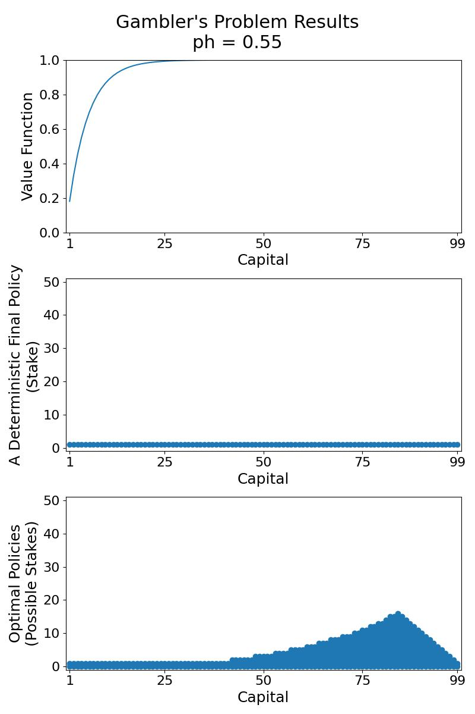

<center><h1> The Gambler's Problem </h1></center>

A gambler has the opportunity to make bets on the outcomes of a sequence of coin flips. If the coin comes up heads, he 
wins as many dollars as he has staked on that flip; if it is tails, he loses his stake. The game ends when the gambler
wins by reaching his goal of $100, or loses by running out of money. On each flip, the gambler must decide what portion
of his capital to stake, in integer numbers of dollars.

This problem can be formulated as an undiscounted, episodic, finite MDP:
<!--- s \in \{0, 1, 2, \dots, 99, 100\} -->
- the state is the gambler’s capital, 
<!--- a \in \{0, 1, \dots, min(s, 100-s)\} --->
- the actions are stakes,  
- the reward is zero on all transitions except those on which the gambler reaches his goal, when it is +1.
- the states 0, where the gambler runs out of money, and 100, where the gambler reaches his goal and wins, are terminal.

The state-value function then gives the probability of winning from each state. A policy is a mapping from levels of 
capital to stakes. The optimal policy maximizes the probability of reaching the goal. Let 
denote the probability of the coin coming up heads. If 
is known, then the entire problem is known and it can be solved, for instance, by value iteration.

This exercise is based on:
- Example 4.3 of Sutton's book "Reinforcement Learning: An Introduction (2nd Edition)"
- Exercise 4.9 of Sutton's book "Reinforcement Learning: An Introduction (2nd Edition)"


```commandline
usage: gambler_value_iteration.py [--ph PH] [--gamma GAMMA] [--epsilon EPSILON] [--plot] [-h]

optional arguments:
  --ph PH            The discount factor of the value iteration algorithm. (DEFAULT=0.40)
  --gamma GAMMA      The discount factor of the value iteration algorithm. (DEFAULT=1.0)
  --epsilon EPSILON  The value iteration algorithm terminates once the value function change is less than epsilon for all states. (DEFAULT=1e-5)
  --plot             Plot and save an animation of the value function for each step of the value iteration algorithm (gambler_vi_animation_{ph}.mp4) and an image with the final value function, all the optimal actions and a
                     deterministic optimal policy (gambler_results_{ph}.jpg).
  -h, --help         Show this help message and exit.
```

```commandline
python3 gambler_value_iteration.py --plot
```
<p align="center">
  
  https://user-images.githubusercontent.com/34735067/147829172-95322a14-d79e-41c0-8393-867c3990a000.mp4
</p>

```commandline
 python3 gambler_value_iteration.py --plot --ph 0.25
```
<p align="center">
  
  https://user-images.githubusercontent.com/34735067/147829195-bbe9c6ed-34cb-4667-ac31-4f264aa958d4.mp4
</p>

```commandline
python3 gambler_value_iteration.py --plot --ph 0.55
```
<p align="center">
  
  https://user-images.githubusercontent.com/34735067/147829222-feedc699-f068-4480-ae01-64e9229de997.mp4
</p>
