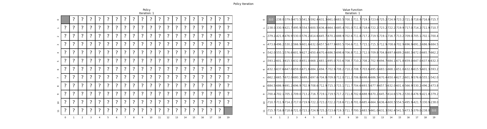

<center><h1> Policy Iteration </h1></center>

This algorithm is used to find the optimal policy 
and its value function , when the environment dynamics
are known. In each step of the algorithm, the current policy is evaluated using iterative policy evaluation and then the
policy is greedily improved in a deterministic way. In this implementation, the first policy that is used is the
equiprobable random policy (all actions equally likely).

The iterative policy evaluation algorithm is based on the Bellman Expectation Equation:

<!---
v(s) = \sum_{a}\pi(a|s)(R_s^a + \gamma \sum_{s'}P_{ss'}^a \ v(s'))
-->

<center>

</center>

This implementation of the algorithm uses synchronous backups to update the value function of each state:

<!---
v_k(s) = \sum_{a}\pi(a|s)(R_s^a + \gamma \sum_{s'}P_{ss'}^a \ v_{k-1}(s'))
-->

<center>

</center>

After the state value function of the current policy is evaluated iteratively using dynamic programming, we calculate the
action value function (based on the Bellman Expectation Equation):

<!---
q(s,a) = R_s^a + \gamma \sum_{s'}P_{ss'}^a \ v(s')
-->

<center>

</center>

Following that, the policy is improved greedily:

<!---
pi(a|s)= \left\{\begin{matrix}
   1, & a = \underset{a'}{arg\ max}\ (q(s,a'))\\
   0, & otherwise\\
\end{matrix}\right.
-->

<center>

</center>

Given that a policy may continually switch between two or more policies that are equally good, the termination criterion
of policy iteration considers the sum of the state value function for two consecutive policies.

This exercise is based on:
- Example 4.1 of Sutton's book "Reinforcement Learning: An Introduction (2nd Edition)"
- Exercise 4.4 of Sutton's book "Reinforcement Learning: An Introduction (2nd Edition)"
- The Policy Iteration example presented in "Lecture 3: Planning by Dynamic Programming" of David Silver's Reinforcement
Learning Course

In the GridWorld environment, the agent can move up, down, left or right from any non-terminal state. The terminal
states are the upper left and the lower right cells. The environment is deterministic, meaning that each action
deterministically causes the corresponding state transition, with the exception of actions that would take the agent off 
the grid. In this case, the state does not change. The optimal policy of the agent and the corresponding value function
are evaluated using the Policy Iteration algorithm.

```commandline
usage: gridworld_policy_iteration.py [--height HEIGHT] [--width WIDTH] [--gamma GAMMA] [--epsilon EPSILON] [--plot] [-h]

optional arguments:
  --height HEIGHT    The height of the grid. (DEFAULT=4)
  --width WIDTH      The width of the grid. (DEFAULT=4)
  --gamma GAMMA      The discount factor of the iterative policy evaluation algorithm. (DEFAULT=1.0)
  --epsilon EPSILON  The iterative policy evaluation algorithm terminates once the value function change is less than epsilon for all states. (DEFAULT=1e-5)
  --plot             Plot and save (as gridworld_pi_animation.gif) the policy that is selected greedily and its value function for every step of the policy iteration algorithm. (DEFAULT=False)
  -h, --help         Show this help message and exit.
```
The following figure is the result of the policy iteration algorithm for a grid of height H=12 and width W=20.
```commandline
python3 gridworld_policy_iteration.py --height 12 --width 20 --plot
```

<center>

</center>