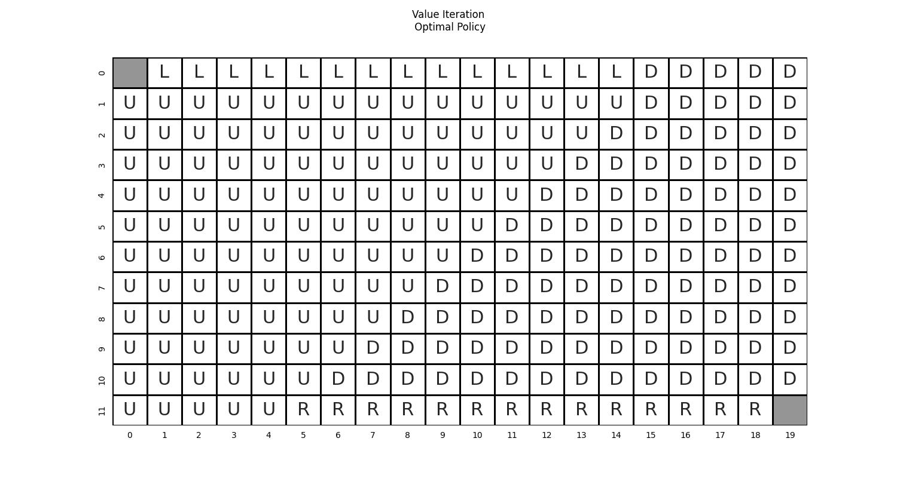

<center><h1> Value Iteration </h1></center>

This algorithm is used to find the optimal policy 
and its value function , when the environment dynamics
are known. In each step of the algorithm, the state value function is updated based on the Bellman Optimality Equation:

<!---
\begin{align*}
v(s) &= \underset{a}{max} \ q(s,a)\\
     &= \underset{a}{max} \ R_s^a + \gamma \sum_{s'}P_{ss'}^a \ v(s')
\end{align} 
-->

<center>

</center>

This implementation of the algorithm uses synchronous backups to update the value function of each state:

<!---
\begin{align*}
v_k(s) &= \underset{a}{max} \ q_k(s,a)\\
     &= \underset{a}{max} \ R_s^a + \gamma \sum_{s'}P_{ss'}^a \ v_{k-1}(s')
\end{align} 
-->

<center>

</center>

The algorithm converges to the state and action value functions of an optimal policy. After the convergence of the 
algorithm, the corresponding deterministic optimal policy is constructed in the following way:

<!---
pi(a|s)= \left\{\begin{matrix}
   1, & a = \underset{a'}{arg\ max}\ (q(s,a'))\\
   0, & otherwise\\
\end{matrix}\right.
-->

<center>

</center>


This exercise is based on:
- Example 4.1 of Sutton's book "Reinforcement Learning: An Introduction (2nd Edition)"
- The Value Iteration example presented in "Lecture 3: Planning by Dynamic Programming" of David Silver's Reinforcement
Learning Course

In the GridWorld environment, the agent can move up, down, left or right from any non-terminal state. The terminal
states are the upper left and the lower right cells. The environment is deterministic, meaning that each action
deterministically causes the corresponding state transition, with the exception of actions that would take the agent off 
the grid. In this case, the state does not change. The optimal policy of the agent and the corresponding value function
are evaluated using the Policy Iteration algorithm.

```commandline
usage: gridworld_value_iteration.py [--height HEIGHT] [--width WIDTH] [--gamma GAMMA] [--epsilon EPSILON] [--plot] [-h]

optional arguments:
  --height HEIGHT    The height of the grid. (DEFAULT=4)
  --width WIDTH      The width of the grid. (DEFAULT=4)
  --gamma GAMMA      The discount factor of the value iteration algorithm. (DEFAULT=1.0)
  --epsilon EPSILON  The value iteration algorithm terminates once the value function change is less than epsilon for all states. (DEFAULT=1e-5)
  --plot             Plot and save an animation (gridworld_vi_animation.gif) of the value function for each step of the value iteration algorithm and an image (gridworld_vi_policy.jpg) with the optimal policy
  -h, --help         Show this help message and exit.
```

The following figures are the results of the value iteration algorithm for a grid of height H=12 and width W=20.
```commandline
python3 gridworld_value_iteration.py --height 12 --width 20 --plot
````
<center>


</center>
