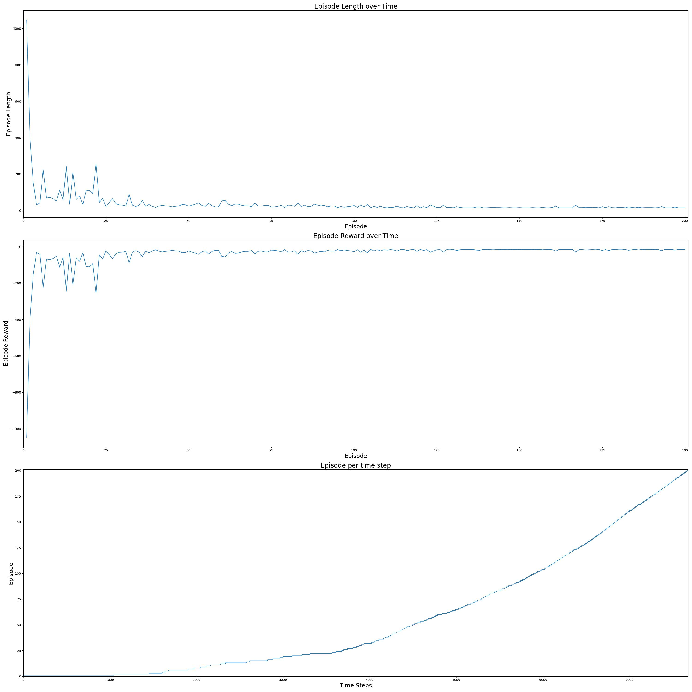
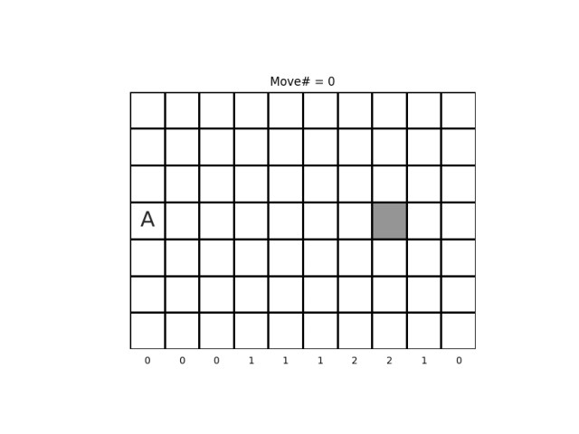
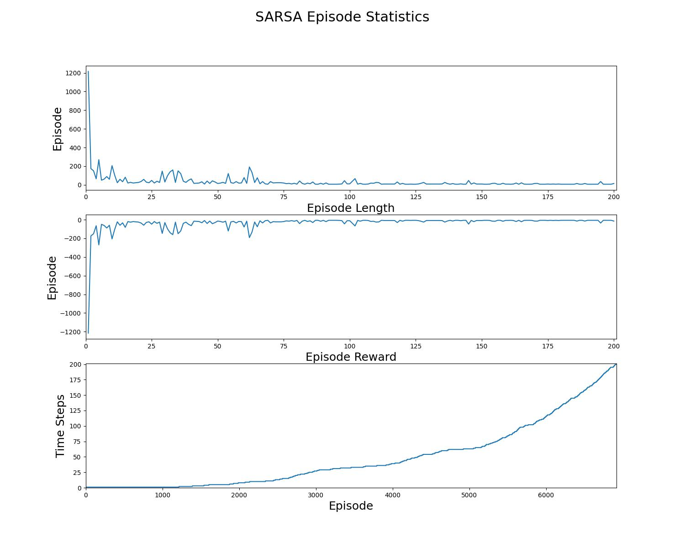

<h1>SARSA (On-Policy TD Control)</h1>

SARSA is a model-free algorithm, which does not assume any knowledge of MDP transitions or rewards. This is an on-policy 
learning algorithm, since the agent follows a policy ,
learns from it and improves it:

<!---
A_1, A_2, \dots, A_{T-1} \sim \pi
--->
<p align="center">

</p>

In order to address the exploration vs exploitation problem, the policy 
is selected to be epsilon-greedy:

<!---
\pi(a|s) = \left \{\begin{array}{ll}
     1 - \epsilon(s) + \frac{\epsilon(s)}{|A|}, & a = \underset{a'}{argmax} \ Q(s,a')\\
     \frac{\epsilon(s)}{|A|}, & otherwise\\
\end{array}\right.
--->
<p align="center">

</p>

with:

<!---
\epsilon(s) = \frac{10}{10+N(s)}
--->
<p align="center">

</p>

where  is the total number of updates of the 
state-action value function .
The epsilon-greedy policy  satisfies the GLIE (Greedy 
in the Limit with Infinite Exploration) criteria:

<!---
\begin{align*}
& \underset{k \to \infty}{lim} \ N_k(s,a) \to \infty \\
& \underset{k \to \infty}{lim} \ \pi_k(a|s) = \textbf{1}(a = \underset{a' \in A}{argmax} \ Q_k(s,a'))
\end{align}
--->

<p align="center">

</p>

In this implementation of the SARSA algorithm, the state-value function 
is updated for every step of an episode. Given the state 
and the action , we observe the reward 
and the new state of the agent . The action
 is sampled from the epsilon greedy policy
. The SARSA algorithm uses bootstrapping to update 
and the proceeds to the state-action pair ,
unless the new state  is terminal:

<!---
\begin{align*}
&Q(S_t, A_t) \leftarrow Q(S_t, A_t) + a (R_t + \gamma Q(S_{t+1}, A_{t+1}) - Q(S_t, A_t))\\
&t \leftarrow t+1 
\end{align} 
--->
<p align="center">

</p>

The TD learning rate , satisfies the Robbins-Monro
criteria:

<!---
\begin{align*}
& \sum_{n=1}^{\infty} \alpha_n = \infty \\
& \sum_{n=1}^{\infty} \alpha_n^2 < \infty \\\
end{align} 
--->
<p align="center">

</p>

since:

<!---
\alpha(s,a) = \sqrt[3]{\frac{10}{10 + N(s,a)}}^2
--->
<p align="center">

</p>

where  is the total number of updates of the 
state-action value function .


Since the GLIE and the Robbins-Monro conditions are satisfied, it is theoretically guaranteed that SARSA converges to 
the optimal policy.


This exercise is based on:
- Example 6.5 of Sutton's book "Reinforcement Learning: An Introduction (2nd Edition)"
- Exercise 6.9 of Sutton's book "Reinforcement Learning: An Introduction (2nd Edition)"
- The SARSA algorithm example presented in "Lecture 5: Model Free Control" of David Silver's Reinforcement Learning 
  Course.

Windy Gridworld is a 7x10 gridworld with:
- start state (3, 0)
- goal state (3, 7)

Compared to a standard gridworld, in this environment there is a crosswind running upward through the middle of the grid.
In the middle region the resultant next states are shifted upward by the "wind" whose strength varies from column to
column. The reward is -1 until goal state is reached. The wind's strength in the Windy Gridworld environment is 
0, 0, 0, 1, 1, 1, 2, 2, 1, 0 from the left to the right column of the grid.

We consider 3 cases:
- The agent' moves are the standard four: up, right, down, and left. (normal moves)
- The agent can also move diagonally: up, right, down, and left, up & right, up & left, down & right, down & left. (king's moves)
- The agent can also stand still: up, right, down, and left, up & right, up & left, down & right, down & left, no move (king's extra moves)

```commandline
usage: windy_gridworld_sarsa.py [--moves {normal_moves,king_moves,king_extra_moves}] [--n_episodes N_EPISODES] [--gamma GAMMA] [--plot] [-h]

optional arguments:
  --moves {normal_moves,king_moves,king_extra_moves}
                        The moves of the normal agent are UP, DOWN, LEFT, RIGHT. The moves of the king agent are UP-RIGHT, UP-LEFT, DOWN-RIGHT, DOWN-LEFT. When the king's extra move is allowed, he can choose NO MOVE.
  --n_episodes N_EPISODES
                        The number of episodes to sample (DEFAULT=200)
  --gamma GAMMA         The discount factor of the SARSA (On-Policy TD Control) algorithm. (DEFAULT=1.0)
  --plot                Plot and save (as windy_gridworld_sarsa_stats_{moves}.jpg) the statistics of the SARSA algorithm in the Windy GridWorld over time and the optimal trajectory (as windy_gridworld_sarsa_animation_{moves}.gif).
                        (DEFAULT=False)
  -h, --help            Show this help message and exit.
```

```commandline
python3 windy_gridworld_sarsa.py --plot --moves normal_moves
```
<p align="center">


</p>

```commandline
python3 windy_gridworld_sarsa.py --plot --moves king_moves
```
<p align="center">


</p>

```commandline
python3 windy_gridworld_sarsa.py --plot --moves king_extra_moves
```
<p align="center">


</p>